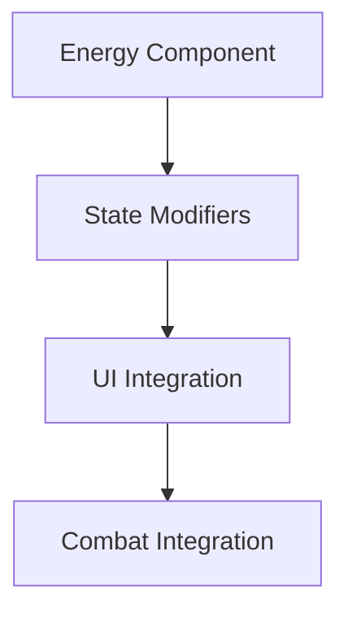
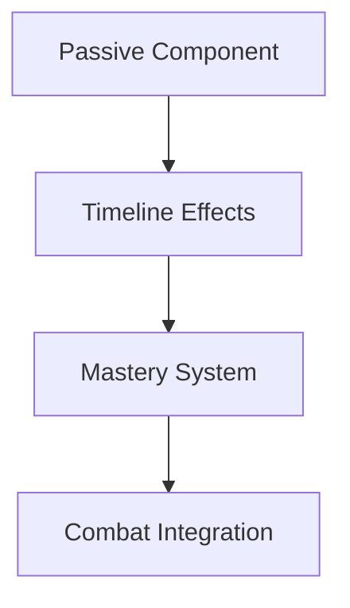

# Shadow Echoes RPG - Task Tracking

## Sprint 1: Core Systems (Weeks 1-2)

### Timeline Energy System
- [ ] High Priority | Timeline Energy Component
```cpp
// Tasks:
1. Create SETimelineEnergyComponent class
2. Implement energy regeneration
3. Add state modifiers
4. Create energy UI widget
```

### Passive Abilities
- [ ] High Priority | Passive System Framework
```cpp
// Tasks:
1. Create SEPassiveAbilityComponent
2. Implement timeline-specific effects
3. Add mastery scaling
4. Create passive ability UI
```

## Sprint 2: Combat Integration (Weeks 3-4)

### Timeline Combat
- [ ] Medium Priority | Combat System Enhancement
```cpp
// Tasks:
1. Add timeline damage modifiers
2. Implement cross-timeline abilities
3. Create combo system
4. Add combat feedback
```

### Visual Effects
- [ ] Medium Priority | Effect System
```cpp
// Tasks:
1. Create particle systems
2. Add post-processing effects
3. Implement camera transitions
4. Add environmental effects
```

## Sprint 3: Polish & Optimization (Weeks 5-6)

### Performance
- [ ] High Priority | System Optimization
```cpp
// Tasks:
1. Optimize asset loading
2. Improve memory management
3. Enhance state transitions
4. Profile and optimize FPS
```

### Visual Polish
- [ ] Medium Priority | Visual Enhancement
```cpp
// Tasks:
1. Polish transition effects
2. Enhance combat feedback
3. Improve UI responsiveness
4. Add visual indicators
```

## Dependencies

### Timeline Energy System


### Passive System


## Technical Requirements

### Performance Targets
```cpp
struct FPerformanceRequirements
{
    // Frame time requirements
    static constexpr float MaxFrameTime = 16.67f;        // 60 FPS
    static constexpr float MaxLoadTime = 1000.0f;        // 1 second
    static constexpr float MaxTransitionTime = 500.0f;   // 0.5 seconds
    
    // Memory requirements
    static constexpr float MaxMemoryUsage = 4096.0f;    // 4 GB
    static constexpr float MaxTextureMemory = 2048.0f;   // 2 GB
    
    // Asset loading
    static constexpr int32 MaxConcurrentLoads = 5;
    static constexpr float LoadTimeout = 10.0f;          // 10 seconds
};
```

### Quality Standards
```cpp
struct FQualityStandards
{
    // Visual quality
    static constexpr float MinVisualQuality = 0.9f;     // 90% quality
    static constexpr float MinEffectQuality = 0.95f;    // 95% effect quality
    
    // Gameplay feel
    static constexpr float MaxInputLatency = 0.1f;      // 100ms
    static constexpr float MinFrameStability = 0.99f;   // 99% stable frames
    
    // Combat responsiveness
    static constexpr float MaxAbilityDelay = 0.05f;     // 50ms
    static constexpr float MaxComboWindow = 0.5f;       // 500ms
};
```

## Testing Requirements

### Unit Tests
```cpp
// Required test coverage:
1. Timeline Energy System
   - Energy regeneration
   - State modifiers
   - Cost calculations

2. Passive System
   - Effect application
   - Mastery scaling
   - Timeline integration

3. Combat System
   - Damage calculation
   - Ability execution
   - Combat flow
```

### Integration Tests
```cpp
// Required test scenarios:
1. Timeline Transitions
   - State changes
   - Asset loading
   - Effect application

2. Combat Scenarios
   - Multi-timeline combat
   - Ability chains
   - Resource management

3. Performance Tests
   - Load testing
   - Memory profiling
   - Frame time analysis
```

## Success Metrics

### Performance Metrics
```cpp
struct FSuccessMetrics
{
    // Core metrics
    float AverageFrameTime;      // Target: < 16.67ms
    float PeakMemoryUsage;       // Target: < 4GB
    float LoadingTime;           // Target: < 1s
    
    // Gameplay metrics
    float AbilityResponseTime;   // Target: < 50ms
    float TransitionSmoothness;  // Target: > 0.95
    float CombatFlowRating;      // Target: > 0.9
    
    bool IsSuccessful() const
    {
        return AverageFrameTime < 16.67f &&
               PeakMemoryUsage < 4096.0f &&
               LoadingTime < 1000.0f &&
               AbilityResponseTime < 50.0f &&
               TransitionSmoothness > 0.95f &&
               CombatFlowRating > 0.9f;
    }
};
```

### Quality Metrics
```cpp
struct FQualityMetrics
{
    // Visual quality
    float EffectQuality;         // Target: > 0.9
    float AnimationSmoothness;   // Target: > 0.95
    float VisualConsistency;     // Target: > 0.9
    
    // Gameplay feel
    float CombatResponsiveness;  // Target: > 0.95
    float AbilityFeedback;       // Target: > 0.9
    float TimelineImpact;        // Target: > 0.9
    
    bool MeetsStandards() const
    {
        return EffectQuality > 0.9f &&
               AnimationSmoothness > 0.95f &&
               VisualConsistency > 0.9f &&
               CombatResponsiveness > 0.95f &&
               AbilityFeedback > 0.9f &&
               TimelineImpact > 0.9f;
    }
};
```

## Daily Progress Tracking

### Week 1
```plaintext
Day 1: Timeline Energy System
- [ ] Create base component
- [ ] Implement regeneration
- [ ] Add state modifiers

Day 2: Energy UI
- [ ] Design energy display
- [ ] Add visual feedback
- [ ] Implement cost preview

Day 3: Passive System
- [ ] Create component structure
- [ ] Add effect system
- [ ] Implement scaling

Day 4: Timeline Integration
- [ ] Connect systems
- [ ] Add state handling
- [ ] Test interactions

Day 5: Testing & Polish
- [ ] Run unit tests
- [ ] Performance testing
- [ ] Bug fixes
```

### Week 2
```plaintext
Day 1: Combat System
- [ ] Add timeline modifiers
- [ ] Implement abilities
- [ ] Create combo system

Day 2: Visual Effects
- [ ] Add particle systems
- [ ] Implement post-processing
- [ ] Create transitions

Day 3: UI Enhancement
- [ ] Update combat UI
- [ ] Add effect feedback
- [ ] Improve responsiveness

Day 4: Integration
- [ ] Connect all systems
- [ ] Test interactions
- [ ] Profile performance

Day 5: Final Polish
- [ ] Visual refinement
- [ ] Performance optimization
- [ ] Documentation
```

This task tracking document provides a detailed breakdown of the remaining work, with clear priorities, dependencies, and success metrics. It will help ensure systematic progress toward completing the implementation while maintaining high quality standards.
